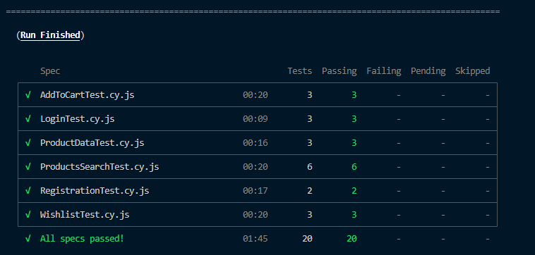
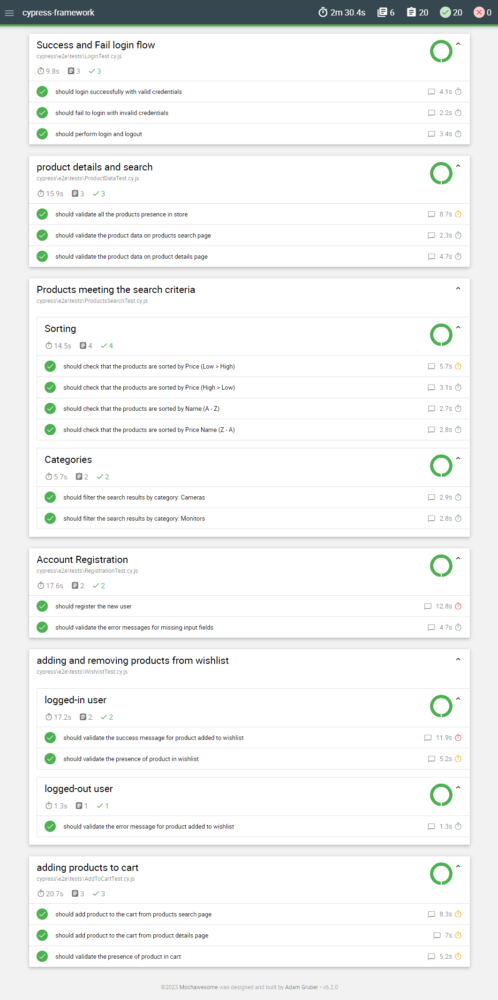
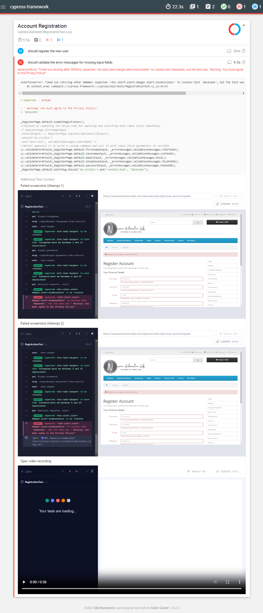
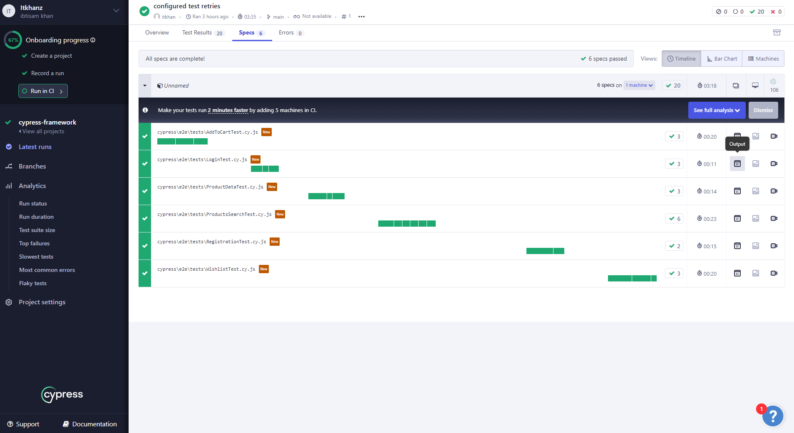
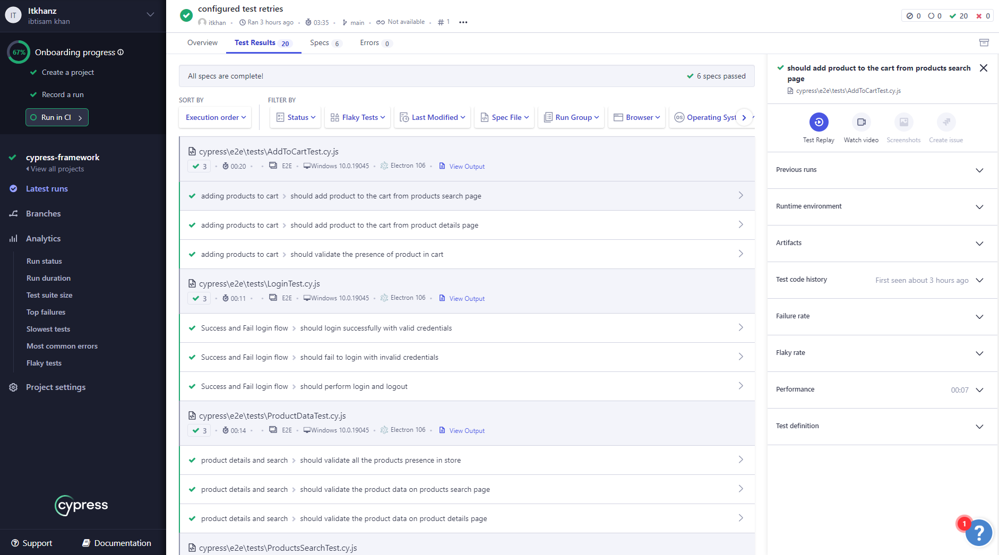
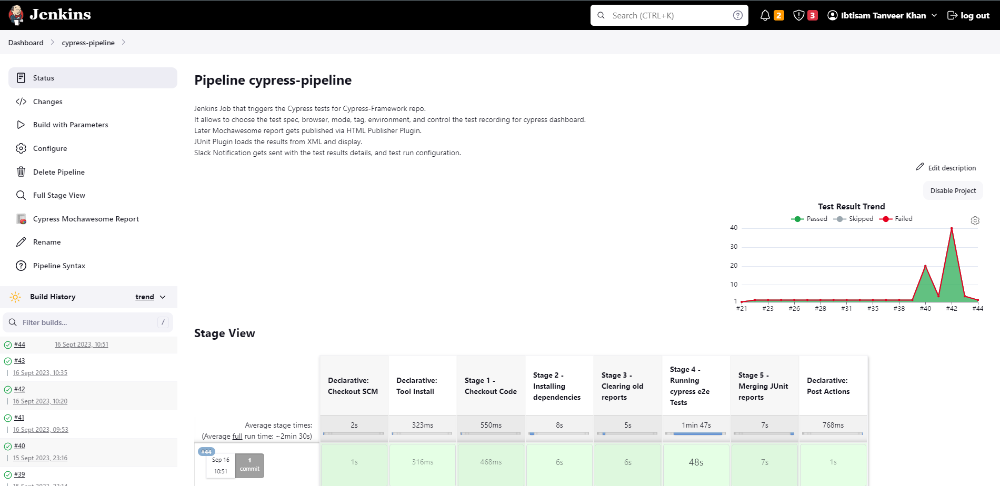
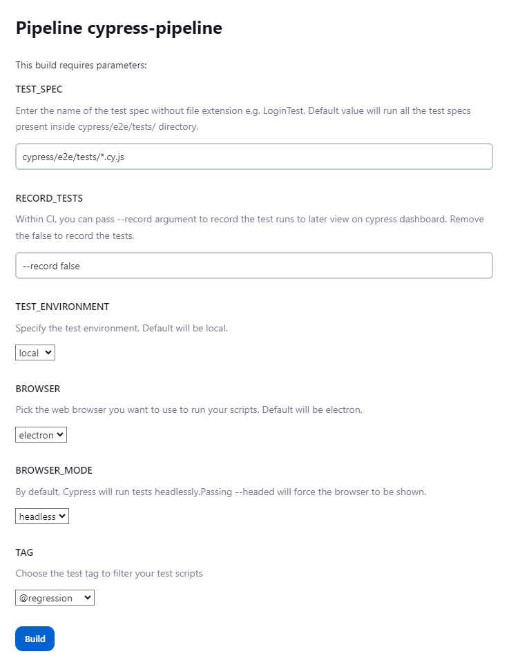
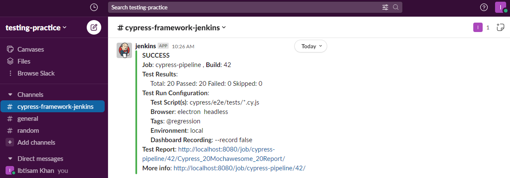

# Cypress Technical Test

[](https://cloud.cypress.io/projects/sh3aqa/runs)
[](https://cloud.cypress.io/projects/sh3aqa/runs)

Framework otomasi pengujian Cypress dibangun dengan JavaScript (JS) yang mengikuti pola desain Page Object Model (POM) untuk mengimplementasikan pengujian UI untuk toko e-commerce OpenCart.
[Cypress-E2E-Web-and-API-Testing](https://github.com/itkhanz/Cypress-E2E-Web-and-API-Testing)

Application Under Test (AUT):
https://naveenautomationlabs.com/opencart/index.php

## Features 💡

- Atomic dan Independen
- Strategi Robust Locator Pencari untuk mencari elemen target
- Tidak ada string yang dikodekan dengan keras dan data uji dalam file spesifikasi
- Hooks untuk melakukan langkah berulang untuk semua pengujian di dalam spesifikasi
- Memuat data pengujian dari file perlengkapan eksternal, yaitu JSON
- Menghasilkan data uji acak dengan pustaka faker
- Memuat konfigurasi spesifik lingkungan dan variabel lingkungan per lingkungan, yaitu dev, stage, prod
- Kemampuan untuk memfilter dan menjalankan pengujian dengan tag tertentu, misalnya regression, smoke
- Melewatkan browser dan mode sebagai variabel lingkungan
- Mengonfigurasi rute (titik akhir URL) dalam file konfigurasi konstan
- Penggunaan Pewarisan OOP untuk memperluas semua halaman dari BasePage
  - Memungkinkan untuk memuat komponen header dan footer dari konstruktor BasePage
  - Memanggil `cy.visit()` dari BasePage dengan jalur yang ditentukan
- Uji Coba Ulang untuk pengujian yang gagal
- Perintah khusus untuk login dan validasi di `cypress/support/commands.js`
- Intellisense untuk perintah khusus di `cypress/support/index.d.ts`
- Fungsi utilitas pengujian yang dapat digunakan kembali di dalam `cypress/e2e/utils`
- Dukungan untuk Cypress Cloud (Dasbor)
- Konfigurasi beberapa reporter (JUnit XML, cpress-mochawesome-reporter HTML)
- Cypress dengan Docker menggunakan Dockerfile dan docker-compose
- Integrasi Continuous Integration CI dengan Jenkins

## Setup 🛠️

### Pre-requisites

- Install NodeJS and NPM pakcage manager.
- Code Editor of your choice e.g. Visual Studio Code
  - Install [ESLint](https://marketplace.visualstudio.com/items?itemName=dbaeumer.vscode-eslint) VS Code extension from Microsoft to make linting work in IDE
- GIT Client (for remote tracking)
- GIT Bash terminal (for Windows)

#### Optional

- Install [Cypress Snippets](https://marketplace.visualstudio.com/items?itemName=CliffSu.cypress-snippets) VS Code Extension that includes the most common cypress snippets.

### Setup from Scratch

- `npm init` to setup node project with package.json
- `npm install --save-dev cypress` to install cypress as dev dependency
- `npx cypress open` to open the cypress test runner and choose `E2E Testing` which will create cypress config, support and fixture folders.
- Pilih browser pilihan Anda, dan contoh perancah yang akan membuat spesifikasi boilerplate dalam folder e2e.
- Hapus spesifikasi boilerplate default dari folder `cypress/e2e`
- Tambahkan `.gitignore` untuk mengecualikan file dan folder dari GIT
- Tambahkan `README.md` ke dokumen
- Mulailah dengan menulis tes di bawah direktori `cypress/e2e`.

#### Integrating ESLint

- Install [ESLint](https://marketplace.visualstudio.com/items?itemName=dbaeumer.vscode-eslint) VS Code extension from Microsoft to make linting work in IDE
- Install eslint in project `npm init @eslint/config --save-dev`
- Install [Cypress ESLint Plugin](https://www.npmjs.com/package/eslint-plugin-cypress) with `npm install eslint-plugin-cypress --save-dev`
- Configure the `.eslintsrc.json` to use recommended settings or add custom rules:

```json
{
  "extends": ["plugin:cypress/recommended"]
}
```

- [Linting Cypress code using ESLint and eslint-plugin-cypress](https://www.youtube.com/watch?v=-YgitwmwFo0)

### Using existing framework

- Clone git repo
- Navigate to folder and open terminal
- Run `npm install` to install the framework dependencies

#### Pre-requistes

- Mendaftarkan pengguna baru di situs web secara manual untuk pertama kalinya.
- Menyimpan kredensial login untuk pengguna terdaftar di bawah `cypress/fixtures/users.json`
- Tambahkan `projectId` untuk Cypress Cloud di `cypress.config.js`

> Untuk menambahkan IntelliSense untuk IDE seperti VS Code, tambahkan [Triple slash directives] [Petunjuk garis miring tiga kali] (https://docs.cypress.io/guides/tooling/IDE-integration#Triple-slash-directives) ke kepala file pengujian atau gunakan [Deklarasi tipe referensi melalui jsconfig.json] (https://docs.cypress.io/guides/tooling/IDE-integration#Triple-slash-directives)

---

## Configurarion ⚙️

- Project specific constants are defined under `cypress/config/constants.js`
- URL routes for pages are defined under `cypress/config/routes.js`. This allows to open the page directly by calling the `open()` method of page.
- Environment specific Cypress settings are placed inside JSON files per enironment in `settings/{environmentName}.settings.json` file. This allows to load separaete settings per environment.
- [Configuration](https://docs.cypress.io/guides/references/configuration)
- [Cypress.config](https://docs.cypress.io/api/cypress-api/config)
- [How To Load Cypress Settings Per Environment](https://glebbahmutov.com/blog/load-cypress-env-settings/)
- [Cypress basics: Using baseUrl](https://filiphric.com/cypress-basics-using-baseurl)
-

---

## Running tests ⚡

- [Command Line](https://docs.cypress.io/guides/guides/command-line)
- [Environment Variables](https://docs.cypress.io/guides/guides/environment-variables)
- `npx cypress open` will open the cypress test runner so you can run the tests from it
- `npx cypress run` will run all the test spec files located within `cypress/e2e` folder. By default test are run in headless mode on electron browser.
- If you want to run test on specific browser, you can provide with `--browser` argument like `--browser chrome`.
- To run tests in headed mode, pass argument `--headed`
- To run a specific test spec, use the following cmd syntax:
  `npx cypress run --spec cypress/e2e/tests/AddToCartTest.cy.js --headed --browser chrome` will run the tests from AddToCartTest spec on chrome browser in headed mode.
- Following custom test scripts are setup in `package.json` to run specific test suites in headless format:
  - `npm run test:registration`
  - `npm run test:login`
  - `npm run test:productData`
  - `npm run test:addToCart`
  - `npm run test:wishlist`
  - `npm run test:productSearch`
- You can also filter the tests based on tag by providing `--env grepTags="<tag>"`
  - For example, To run the tests that are tagged as `@smoke`:
    - `npx cypress run --spec cypress/e2e/tests/AddToCartTest.cy.js --env grepTags="@smoke"`
    - To use the command line args with npm run scripts, append an extra `--`
      - `npm run test:addToCart -- --env grepTags="@smoke"`
  - Similarly you can filter the test based on its title by providing ` --env grep="<substring_in_spec_title>`
- To run the tests on any specific browser in headed mode:
  - For example, `npm run test:addToCart -- --env grepTags="@smoke" --headed --browser chrome` will run the smoke tests from addToCart spec on chrome browser in headed mode
- You can also change baseUrl, configuration files and enironment variables during test execution by passing the `environmentName` enviornment variable.
- Summing up all the above configuration, here is an example:

  - `npm run test:registration -- --env environmentName="stage",grepTags="@smoke" --headed --browser chrome` will run tests with following configurations:
    - **spec** `RegistrationTest.cy.js`
    - **browser** `chrome`
    - **mode** `headed`
    - **tag** `smoke`
    - **environmentName** `stage`
    - **baseUrl** `https://stage.naveenautomationlabs.com/opencart/index.php` is automatically teken from `environmentName`

- Tambahkan eksekusi cloud dan perekaman uji coba ke skrip yang sudah ada dengan menambahkan `-- --record --key <key>` di akhir npm test scripts. For example, `npm run test:registration -- --env environmentName="local",grepTags="@smoke" --record --key <KEY_VALUE>`
- Terminal output shows the results summary as:



---

## Test Reporting 📑

- This framework uses [cypress-mochawesome-reporter](https://www.npmjs.com/package/cypress-mochawesome-reporter) to generate HTML test reports.
- Add the following options to `cypress.config.js`
  ```js
   //cypress-mochawesome-reporter
  reporter: 'cypress-mochawesome-reporter',
  reporterOptions: {
    charts: true, //Genarates Chart in HTML report
    reportPageTitle: 'OpenCart Test Report', //Report title will be set to the mentioned string
    embeddedScreenshots: true, //Screenshot will be embedded within the report
    inlineAssets: true, //No separate assets folder will be created
    videoOnFailOnly: false, //If Videos are recorded and added to the report, setting this to true will add the videos only to tests with failures.
  },
  ```
- Laporan HTML dibuat secara default di folder `root/cypress/reports`.
- Menyematkan tangkapan layar dari pengujian kegagalan secara otomatis ke laporan, dan juga melampirkan video ke laporan.
- Hal ini juga memungkinkan kustomisasi laporan dengan kontrol yang lebih baik tentang bagaimana dan di mana laporan dihasilkan.
- Seperti inilah tampilan dasbor laporan:
  

- Some ther reporting possibilities are:
  - [mochawesome](https://www.npmjs.com/package/mochawesome)
  - [cypress-allure-plugin](https://www.npmjs.com/package/@shelex/cypress-allure-plugin)
- Jika test case gagal, maka kesalahan pernyataan, screenshot, dan video akan dilampirkan ke laporan secara otomatis.
  - Saat test retries, Cypress akan terus mengambil tangkapan layar untuk setiap percobaan yang gagal atau cy.screenshot() dan menambahkan setiap screenshot baru dengan (percobaan n), sesuai dengan nomor percobaan ulang saat ini.


  
  ## Multiple Reporters

- [Configure Multiple Reports](https://docs.cypress.io/guides/tooling/reporters)
- Sering kali kita melihat pengguna menginginkan kemampuan untuk menggunakan beberapa reporter. Ketika menjalankan di CI, Anda mungkin ingin membuat laporan untuk junit dan mungkin laporan json. Ini bagus, tetapi dengan mengatur reporter ini, Anda tidak akan menerima umpan balik tambahan saat pengujian berjalan!
- Kerangka kerja dikonfigurasi untuk melaporkan laporan XML JUnit, serta laporan HTML mochawesome.
  - Menginstal dependensi tambahan dengan `npm install --save-dev cypress-multi-reporter mocha-junit-reporter`
  - Tentukan reporter dan reporterOptions dalam konfigurasi Cypress Anda:

```
reporter: 'cypress-multi-reporter',
  reporterOptions: {
    configFile: 'reporter-config.json',
  },
```

- Kemudian tambahkan berkas `reporter-config.json` yang terpisah (didefinisikan dalam konfigurasi Anda) untuk mengaktifkan reporter mochawesome dan junit dan mengarahkan reporter junit untuk menyimpan berkas XML yang terpisah.

```json
{
  "reporterEnabled": "cypress-mochawesome-reporter, mocha-junit-reporter",
  "mochaJunitReporterReporterOptions": {
    "mochaFile": "cypress/results/junit/results-[hash].xml"
  },
  "cypressMochawesomeReporterReporterOptions": {
    "reportDir": "cypress/results/cypress-mochawesome-reporter",
    "charts": true,
    "reportPageTitle": "OpenCart Test Report",
    "embeddedScreenshots": true,
    "inlineAssets": true,
    "videoOnFailOnly": false
  }
}
```

- Hasil pengujian dihasilkan di bawah direktori:
  - `cypress/results/junit` untuk laporan XML JUnit
  - `cypress/results/cypress-mochawesome-reporter` untuk laporan HTML mochawesome
- Jika Anda ingin menggabungkan file XML yang dihasilkan menjadi satu file, [junit-report-merger](https://www.npmjs.com/package/junit-report-merger) dapat ditambahkan.
- Tambahkan skrip di `package.json` untuk menghapus laporan sebelum uji coba, dan menggabungkan laporan XML JUnit ke dalam satu laporan XML tunggal setelah uji coba selesai.

```json
{
  "results-junit:delete": "rm -rf cypress/results/junit/* || true",
  "results-junit:combine": "jrm cypress/results/junit/combined-report.xml \"cypress/results/junit/*.xml\"",
  "report:pre": "npm run results-junit:delete",
  "report:post": "npm run results-junit:combine",
  "test:report": "npm run report:pre && npx cypress run && npm run report:post"
}
```

- `rm` dan `true` adalah perintah shell asli sehingga skrip di atas tidak akan berjalan di terminal poweshell, oleh karena itu gunakan terminal GIT Bash jika Anda menggunakan windows.

---

## Cypress Cloud ☁️

- Rekam proses pengujian untuk melihat hasil pengujian Anda di Cypress Cloud. Anda kemudian dapat mengoptimalkan rangkaian pengujian Anda, men-debug pengujian yang gagal dan bersisik, Test Replay, menonton video, melihat keluaran konsol dan tangkapan layar, serta mengintegrasikannya dengan alat favorit Anda.
- [Dokumentasi Cypress Cloud](https://docs.cypress.io/guides/cloud/introduction)
- [ID Proyek Cypress dan Kunci Rekaman](https://docs.cypress.io/guides/cloud/account-management/projects)
- [Rekam tes](https://docs.cypress.io/guides/continuous-integration/introduction#Record-tests)

  - Setelah Anda menyiapkan proyek Anda untuk direkam, Cypress menghasilkan projectId unik untuk proyek Anda dan secara otomatis memasukkannya ke dalam file konfigurasi Cypress Anda. ProjectId adalah sebuah string 6 karakter dalam konfigurasi Cypress Anda.
  - Kunci rekaman digunakan untuk mengautentikasi bahwa proyek Anda diizinkan untuk merekam tes ke Cypress Cloud. Selama kunci rekaman Anda tetap bersifat pribadi, tidak seorang pun akan dapat merekam uji coba untuk proyek Anda - meskipun mereka memiliki projectId Anda.
  - Buat `cypress.env.json` di direktori root yang akan diperiksa secara otomatis oleh Cypress. Nilai di sini akan menimpa variabel lingkungan yang saling bertentangan dalam konfigurasi Cypress Anda. Strategi ini berguna karena jika Anda menambahkan cypress.env.json ke berkas `.gitignore` Anda, nilai di sini bisa berbeda untuk setiap mesin pengembang.

  ```json
  {
    "projectId": ""
  }
  ```

- Run the test via `npx cypress run --record --key <record key>`





---

## Docker 🐋

Jika ingin menjalankan pengujian menggunakan Docker, Anda dapat melakukan hal berikut di terminal Anda (Powershell) di workspace project.-

```bash
# Without docker-compose

# Build the docker image from Dockerfile
> docker build -t cypress_docker .

# Run the following command to run all tests with test:all script inside docker
> docker run -i -v ${PWD}:/cypress_docker -t cypress_docker:latest test:all

# You can also pass command line parameters optionally to further narrow down your tests
> docker run -i -v ${PWD}:/cypress_docker -t cypress_docker:latest test:registration -- --env environmentName="local",grepTags="@smoke" --headed --browser chrome
```

```bash
# With docker-compose

# Build the docker image from Dockerfile
> docker build -t cypress_docker .

# Execute the following command to compile the file. <YourVersionTag> may be any value you want
> docker build -t cypress_docker:<YourVersionTag> .

# Then, execute the following command to run the tests inside of the container
> docker-compose up

# To run cross browser tests on multiple browsers
> docker-compose -f docker-compose-browsers up

# To stop the docker compose execution
> docker-compose -f docker-compose-browsers.yml down --volumes --remove-orphans

# You can also combine the building of image and running of test in single step
> docker-compose -f docker-compose-build.yml up --build
```

- - Untuk detail lebih lanjut tentang cypress dengan docker, baca [cypress docker](./doc/docker.md)

## Continuous Integration CI 🚀

Proyek dikonfigurasi untuk menjalankan Cypress dalam Integrasi Berkelanjutan dengan beberapa Penyedia CI.

### Jenkins Integration


* Framework ini mendukung Continous Integration CI dengan Jenkins, dan menawarkan eksekusi yang sepenuhnya disesuaikan dengan dukungan untuk:
  * Skrip Pipeline Jenkinsfile
  * Membangun dengan Parameter
    * Memungkinkan untuk memilih spesifikasi pengujian, browser, mode browser, tag, lingkungan, perekaman dasbor.
  * Menerbitkan laporan HTML Mochawesome melalui Plugin Penerbit HTML
  * Mengurai hasil JUnit XML untuk menampilkan ringkasan dan tren hasil pengujian
  * Mengirimkan Notifikasi Slack dengan ringkasan hasil pengujian, tautan ke laporan pengujian, dan pekerjaan.
* Lihat [Jenkinsfile](./Jenkinsfile) untuk melihat bagaimana pipeline dikonfigurasi.
* Untuk detail lebih lanjut tentang cypress dengan Jenkins, baca [Cypress Jenkins](./doc/jenkins.md)






